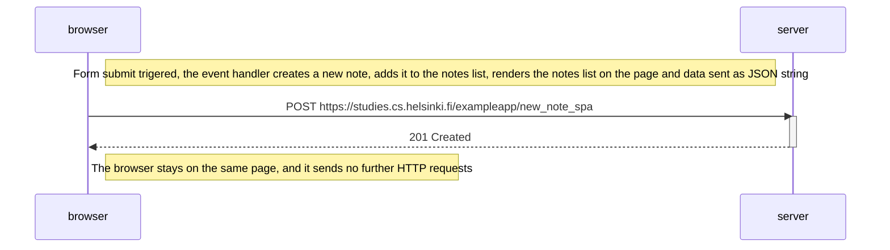

```mermaid

sequenceDiagram
    participant browser
    participant server

    Note right of browser: Form submit trigered, the event handler creates a new note, adds it to the notes list, renders the notes list on the page and data sent as JSON string

    browser->>server: POST https://studies.cs.helsinki.fi/exampleapp/new_note_spa
    activate server
    server-->>browser: 201 Created
    deactivate server

    Note right of browser: The browser stays on the same page, and it sends no further HTTP requests

```
