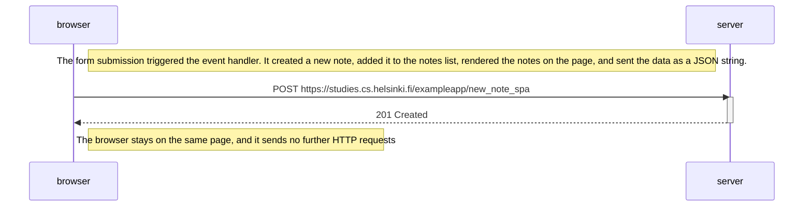

```mermaid

sequenceDiagram
    participant browser
    participant server

    Note right of browser: The form submission triggered the event handler. It created a new note, added it to the notes list, rendered the notes on the page, and sent the data as a JSON string.

    browser->>server: POST https://studies.cs.helsinki.fi/exampleapp/new_note_spa
    activate server
    server-->>browser: 201 Created
    deactivate server

    Note right of browser: The browser stays on the same page, and it sends no further HTTP requests

```
